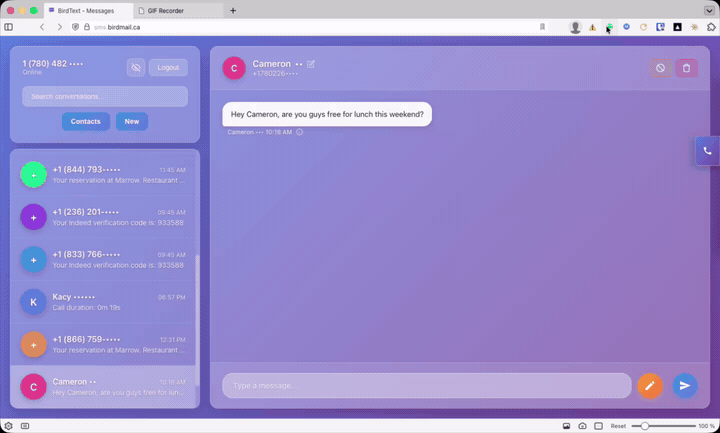
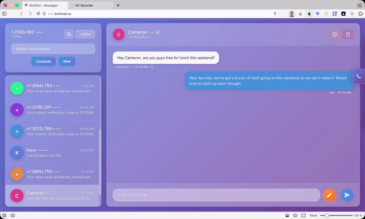
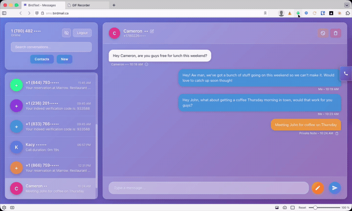
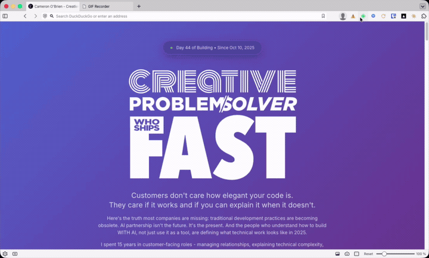

# Voip.ms SMS & Call Platform

A personal SMS and voicemail platform for [voip.ms](https://voip.ms). Send and receive texts, make WebRTC calls, and get AI-powered reply suggestions—all through a clean web interface.

Built for personal use, not business. No team features, no billing, no complexity.

---

## Features

### AI-Powered Reply Drafting

Generate contextual replies based on your relationship with each contact. Powered by Claude.



---

### Send & Receive SMS

Full SMS support through voip.ms API with delivery confirmation and private notes.



---

### WebRTC Phone Calls

Make and receive calls directly in the browser via FreeSWITCH gateway.



---

### Voicemail with Transcription

Automatic voicemail transcription with audio playback.



---

### Privacy Mode

Toggle to mask names and phone numbers for screen sharing or demos. Persists across sessions.

---

### Additional Features

- **Contact Management** - Create, edit, delete contacts with notes and AI preferences
- **Spam Filtering** - Mark contacts as spam, view spam list, restore
- **Unread Indicators** - Visual indicators for new messages
- **Message Search** - Filter conversations by name or number
- **Click-to-Copy** - Copy phone numbers with one click
- **Responsive Toasts** - Notifications for all actions

---

## Tech Stack

**Frontend**
- Plain HTML/CSS/JavaScript (no framework)
- JsSIP for WebRTC calling

**Backend**
- Node.js 18+
- Vercel Edge Functions
- TypeScript

**Database**
- Neon PostgreSQL (serverless)

**Services**
- [voip.ms](https://voip.ms) - SMS and voice
- [Anthropic Claude](https://anthropic.com) - AI reply drafting
- [Vercel Blob](https://vercel.com/storage/blob) - Voicemail storage
- FreeSWITCH - SIP gateway

---

## Security

### Application Security

- PBKDF2 password hashing (100,000 iterations)
- JWT session tokens
- CSRF protection on all state-changing endpoints
- Brute-force login protection
- Security headers (CSP, HSTS, X-Frame-Options)

### FreeSWITCH Security (CRITICAL)

**⚠️ VoIP systems are high-value targets for attackers.** Compromised SIP servers can be used to make expensive international calls, resulting in thousands of dollars in charges.

**Required Security Measures**:

1. **Firewall Configuration (MANDATORY)**
   - **NEVER** expose SIP ports (5060, 5080) to the entire internet
   - Use IP-based firewall rules to restrict access to your VoIP provider's IPs only
   - Example using UFW:
     ```bash
     # Block general access
     ufw default deny incoming

     # Allow ONLY your VoIP provider's IPs
     ufw allow from <VOIP_PROVIDER_IP> to any port 5060 proto udp
     ufw allow from <VOIP_PROVIDER_IP> to any port 5080 proto tcp
     ufw allow from <VOIP_PROVIDER_IP> to any port 16384:32768 proto udp
     ```

2. **Strong Authentication**
   - Use cryptographically strong passwords (20+ characters, random)
   - **NEVER** use default FreeSWITCH extension passwords (1000-1019 with password "1234")
   - Disable all unused extensions

3. **Intrusion Prevention**
   - Install and configure fail2ban for FreeSWITCH
   - Automatically ban IPs after failed authentication attempts
   - Monitor logs for suspicious activity

4. **Defense in Depth**
   - Firewall restrictions (primary defense)
   - Strong passwords (authentication layer)
   - fail2ban (automated response)
   - Regular log monitoring

**November 2025 Security Note**: This project's FreeSWITCH server was compromised due to open SIP ports and default extension passwords. Attackers made 2,825 unauthorized call attempts before the breach was detected and remediated. Comprehensive security hardening was implemented (see `SECURITY_LOG.md` for details). Don't let this happen to you—secure your FreeSWITCH server BEFORE deploying to production.

---

## Setup

### Prerequisites

- Node.js 18+
- voip.ms account with API access enabled
- Neon PostgreSQL database
- FreeSWITCH server (for voice calls)
- Anthropic API key (for AI features)

### Installation

1. Clone the repository
```bash
git clone https://github.com/yourusername/voip-text.git
cd voip-text
```

2. Install dependencies
```bash
npm install
```

3. Set up environment variables (see below)

4. Run database migrations
```bash
# Using psql with your DATABASE_URL
psql $DATABASE_URL -f migrations/001_initial_schema.sql
psql $DATABASE_URL -f migrations/002_add_timezone_support.sql
psql $DATABASE_URL -f migrations/003_add_call_support.sql
psql $DATABASE_URL -f migrations/004_add_spam_support.sql
psql $DATABASE_URL -f migrations/005_add_ai_preferences.sql
psql $DATABASE_URL -f migrations/006_add_brute_force_protection.sql
```

5. Deploy to Vercel
```bash
vercel --prod
```

### Environment Variables

```bash
# Database
DATABASE_URL=postgresql://...

# Authentication
SESSION_SECRET=your-32-char-secret-minimum

# voip.ms API
VOIPMS_EMAIL=your@email.com
VOIPMS_API_PASSWORD=your-api-password
VOIPMS_DID=+17801234567

# FreeSWITCH (for voice calls)
FREESWITCH_SERVER=voip.example.com
FREESWITCH_WSS_PORT=8081
FREESWITCH_USER=your-sip-user
FREESWITCH_PASSWORD=your-sip-password

# AI Features
ANTHROPIC_API_KEY=sk-ant-...
AI_DRAFT_RATE_LIMIT=20
```

---

## voip.ms Configuration

1. Enable API access in voip.ms portal
2. Set API password (different from account password)
3. Configure SMS webhook URL: `https://yourdomain.com/api/webhooks/voipms/sms`
4. Enable SMS on your DID

---

## Project Structure

```
voip-text/
├── api/                    # Vercel Edge Functions
│   ├── auth/              # Authentication endpoints
│   ├── messages/          # SMS/voicemail management
│   ├── contacts/          # Contact CRUD
│   ├── ai/                # AI reply drafting
│   ├── calls/             # Call tracking
│   └── webhooks/          # voip.ms, Resend webhooks
├── public/                # Frontend
│   ├── index.html         # Main app
│   ├── login.html         # Login page
│   ├── js/main.js         # Application logic
│   └── css/main.css       # Styles
├── migrations/            # Database schema
├── utils/                 # Shared utilities
└── types/                 # TypeScript definitions
```

---

## API Endpoints

### Authentication
- `POST /api/auth/login` - Login
- `POST /api/auth/logout` - Logout
- `GET /api/auth/me` - Check session
- `GET /api/auth/csrf-token` - Get CSRF token

### Messages
- `GET /api/messages` - List conversations
- `POST /api/messages/send` - Send SMS
- `GET /api/messages/conversation/[id]` - Get conversation
- `DELETE /api/messages/conversation/[id]` - Delete conversation
- `POST /api/messages/note` - Save private note

### Contacts
- `GET/POST /api/contacts` - List/create contacts
- `GET/PUT/DELETE /api/contacts/[id]` - Manage contact
- `PUT /api/contacts/[id]/spam` - Toggle spam

### AI
- `POST /api/ai/draft-reply` - Generate reply options

### Webhooks
- `POST /api/webhooks/voipms/sms` - Incoming SMS
- `POST /api/webhooks/resend/voicemail` - Voicemail transcription

---

## License

MIT

---

## Acknowledgments

- [voip.ms](https://voip.ms) for affordable VoIP service
- [JsSIP](https://jssip.net) for WebRTC SIP library
- [Neon](https://neon.tech) for serverless PostgreSQL
